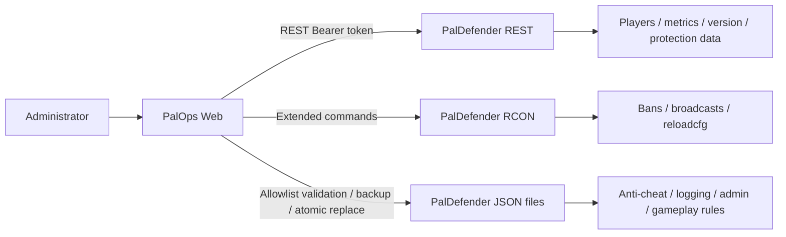
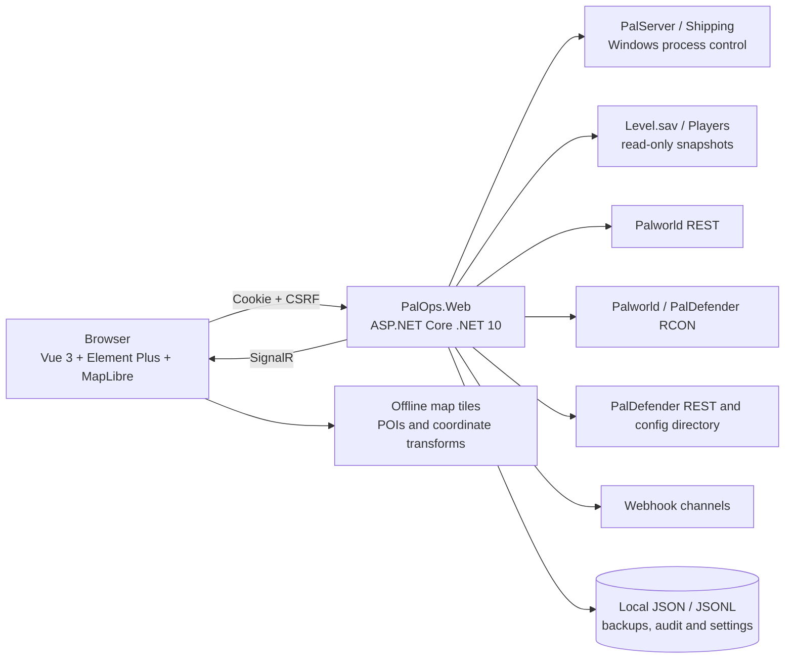

<div align="center">

# PalOps Web

### A modern all-in-one Palworld server operations console built around the PalDefender anti-cheat plugin

PalOps Web combines **PalDefender REST, extended RCON, and configuration management** with PalServer lifecycle control, save indexing, player and guild intelligence, offline maps, resource grants, backups, automation, notifications, and audit-ready access control.

[简体中文](README.md) · [中文文档](docs/README.md) · [English Docs](docs/README.en.md)


</div>


## Project scope

PalOps Web is not a generic cloud control panel. It is designed for a Windows host running Palworld Dedicated Server locally. Its defining feature is deep integration with the PalDefender anti-cheat plugin: PalDefender REST data, extended RCON commands, version checks, whitelist and ban data, and managed JSON configuration are presented alongside native Palworld REST, RCON, process control, and read-only save parsing.

PalDefender remains an independent optional component. Core lifecycle, save, map, backup, and administration features can operate without it, while PalDefender-dependent protection and extended runtime capabilities are shown as not configured.

## Complete feature inventory

| Area | Module | Capabilities |
|---|---|---|
| Server | **Operations overview** | Runtime state, PID, uptime, CPU, memory, storage, online population, Server FPS, live events |
| Server | **Player management** | Online/offline players, profile attributes, guilds, positions, inventory, pals, source evidence |
| Server | **Guild bases** | Members, leader, resolved and unresolved bases, association evidence, direct map navigation |
| Server | **World map** | Offline Palpagos / World Tree tiles, 1,242 POIs, players, bases, custom markers, exploration state |
| Operations | **Resource grants** | Multi-player targeting, multi-term search, item/pal cart, progression grants, execution results |
| Operations | **Message delivery** | Broadcasts, alerts, direct messages, player targeting, management actions |
| Operations | **RCON command control** | Native and PalDefender RCON, capability probing, high-risk acknowledgement, response history |
| Operations | **Automation jobs** | Cron and interval jobs, backups, announcements, restarts, risk levels, run history |
| Saves | **Save backups** | Manual/automatic backups, SHA-256 verification, retention, download, protected restore |
| Notifications | **Notification channels** | WeCom, DingTalk, Feishu, Discord, Slack, Telegram, generic JSON webhooks |
| Notifications | **Delivery history** | Success, retry and failure records, HTTP results, latency and error details |
| System | **System settings** | Palworld REST, PalDefender REST, RCON, save, backup and automation configuration |
| System | **PalDefender console** | Version, connectivity, generated configuration, localized field help, validation and atomic save |
| System | **Save indexing** | Read-only Level.sav / Players snapshots, scheduling, progress, format inspection and fallback |
| System | **Catalog management** | Item and pal catalog search, categories, aliases, favorites and import |
| System | **Audit log** | Structured login, lifecycle, configuration, RCON, backup, notification and user audit events |
| System | **System logs** | Noise-reduced operational logs, filtering, search and exception details |
| System | **User management** | Owner, Administrator, Operator, Auditor and Viewer accounts |
| System | **About the project** | Version, dependencies, data provenance, licensing and support boundaries |

## Screenshots

All screenshots below are produced from the current frontend build with sanitized demonstration data.

### Server intelligence

<table>
<tr>
<td width="50%"><br><sub><b>Operations overview</b></sub></td>
<td width="50%"><br><sub><b>Player management</b></sub></td>
</tr>
<tr>
<td width="50%"><br><sub><b>Guild bases</b></sub></td>
<td width="50%"><br><sub><b>World map</b></sub></td>
</tr>
</table>

### Operations

<table>
<tr>
<td width="50%"><br><sub><b>Resource grants</b></sub></td>
<td width="50%"><br><sub><b>Message delivery</b></sub></td>
</tr>
<tr>
<td width="50%"><br><sub><b>RCON command control</b></sub></td>
<td width="50%"><br><sub><b>Automation jobs</b></sub></td>
</tr>
<tr>
<td width="50%"><br><sub><b>Save backups</b></sub></td>
<td width="50%"><br><sub><b>Save indexing</b></sub></td>
</tr>
</table>

### Notifications

<table>
<tr>
<td width="50%"><br><sub><b>Notification channels</b></sub></td>
<td width="50%"><br><sub><b>Delivery history</b></sub></td>
</tr>
</table>

### PalDefender and governance

<table>
<tr>
<td width="50%"><br><sub><b>System settings</b></sub></td>
<td width="50%"><br><sub><b>PalDefender console</b></sub></td>
</tr>
<tr>
<td width="50%"><br><sub><b>Catalog management</b></sub></td>
<td width="50%"><br><sub><b>Audit log</b></sub></td>
</tr>
<tr>
<td width="50%"><br><sub><b>System logs</b></sub></td>
<td width="50%"><br><sub><b>User management</b></sub></td>
</tr>
<tr>
<td width="50%"><br><sub><b>About the project</b></sub></td>
<td width="50%"><br><sub><b>Dark theme</b></sub></td>
</tr>
</table>

## PalDefender integration



The integration covers version comparison, REST connectivity, localized `Config.json` metadata, generated REST/token/whitelist/ban/import/template files, JSON validation, SHA-256 optimistic concurrency, backups, atomic writes, reload guidance, and extended RCON capability probing.

See [PalDefender deployment](docs/paldefender-deployment.en.md) and [PalDefender configuration management](docs/paldefender-configuration-management.en.md).

## Architecture



## Quick start

Requirements: Windows, .NET 10 SDK, Node.js 22, and a local Palworld Dedicated Server. PalDefender is recommended for the complete feature set.

```powershell
git clone <your-repository-url>
cd PalOpsWeb
.\scripts\build.ps1
```

Create a Windows release:

```powershell
.\scripts\fetch-map-tiles.ps1 -Layer all
.\scripts\publish-win-x64.ps1 -Version 1.1.0
```

See the [build guide](docs/build.en.md) and [deployment guide](docs/deployment.en.md).

## Documentation

Chinese is the default documentation language. Each public technical document has an English counterpart.

| Topic | 中文 | English |
|---|---|---|
| Documentation index | [docs/README.md](docs/README.md) | [docs/README.en.md](docs/README.en.md) |
| Architecture | [architecture.md](docs/architecture.md) | [architecture.en.md](docs/architecture.en.md) |
| Build | [build.md](docs/build.md) | [build.en.md](docs/build.en.md) |
| Deployment | [deployment.md](docs/deployment.md) | [deployment.en.md](docs/deployment.en.md) |
| PalDefender deployment | [paldefender-deployment.md](docs/paldefender-deployment.md) | [paldefender-deployment.en.md](docs/paldefender-deployment.en.md) |
| PalDefender configuration | [paldefender-configuration-management.md](docs/paldefender-configuration-management.md) | [paldefender-configuration-management.en.md](docs/paldefender-configuration-management.en.md) |
| World map data | [world-map-data-1.1.0.md](docs/world-map-data-1.1.0.md) | [world-map-data-1.1.0.en.md](docs/world-map-data-1.1.0.en.md) |
| Release checklist | [release-checklist.md](docs/release-checklist.md) | [release-checklist.en.md](docs/release-checklist.en.md) |

## GitHub Actions

The workflow runs Node.js 22 frontend contracts, TypeScript and Vite builds, npm high-severity auditing, .NET 10 restore/build, catalog and map verification, documentation validation, and repository hygiene checks. The project has no Python runtime, build, or release dependency, and the repository gate rejects Python source and Japanese Markdown.

## Security and license

Do not expose PalOps, Palworld REST, PalDefender REST, or RCON directly to the public Internet. Use a trusted LAN, VPN, or correctly configured HTTPS reverse proxy. Never commit saves, runtime data, logs, Data Protection keys, passwords, tokens, or cookies.

See [SECURITY.md](SECURITY.md) and [CONTRIBUTING.md](CONTRIBUTING.md).

PalOps Web is licensed under **GNU GPL v3 or later**. Palworld names, trademarks, and game assets belong to their respective owners. This project is not affiliated with or endorsed by Pocketpair.
