<div align="center">

# PalOps Web

### An integrated Palworld server operations console built around the PalDefender anti-cheat plugin

**1.3.1** brings PalServer lifecycle control, live monitoring, offline world maps, players and guilds, resource grants, save parsing, configuration, diagnostics, disaster recovery, security, and integrations into one modern web workspace.

[简体中文](README.md) · [Chinese Docs](docs/README.md) · [English Docs](docs/README.en.md) · [Feature Reference](docs/features.en.md)

<a href="https://dotnet.microsoft.com/"></a>
<a href="https://vuejs.org/"></a>
<a href="https://github.com/Ultimeit/PalDefender"></a>
<a href="https://maplibre.org/maplibre-gl-js/docs/"></a>
<a href="https://learn.microsoft.com/en-us/windows-server/"></a>
<a href="LICENSE"></a>

</div>


> **Screenshot policy:** Every UI image in this README was captured from the current V1.3.1 frontend pages using dedicated synthetic data, fictional players and guilds, reserved addresses, and the bundled offline map tiles. No production server IP, world ID, account, token, webhook, cookie, save path, or live operator data is included.

## What is new in V1.3.1

- **Player-first map markers**: online-player markers are always rendered above guild bases; overlapping players remain visible and receive click priority.
- **Point-and-click teleportation**: map clicks now send the PalDefender map X/Y coordinate space directly and can teleport one or more online players to any valid point.
- **Automatic terrain height**: point teleportation omits Z by default so PalDefender resolves a safe terrain height; manual Z remains available for caves, underground areas, and exceptional locations.
- **Live player-to-player teleportation**: move player A to player B's position resolved at execution time instead of relying on stale coordinates.
- **Redesigned exploration progress**: overall completion, per-category progress, discovered/remaining counts, and incomplete-only filtering make long-running map exploration easier to manage.
- **Automatic local-data initialization**: first startup creates local data structures automatically and idempotently; the repair entry appears only after a real initialization failure.
- **Faster navigation**: dependency readiness is cached and refreshed silently in the background, eliminating repeated full-page “checking dependencies” states and reducing duplicate requests and remounts.
- **Rebuilt open-source publication**: the Chinese and English READMEs now use 37 freshly captured feature views each—74 synthetic-data screenshots in total—with a clear three-image “players → resources → review and execute” grant workflow.

## Why PalOps Web

PalOps Web is not a generic cloud control panel. It targets **Windows dedicated servers where PalOps runs on the same host as PalServer**, solving the operational fragmentation between process control, player data, save tools, maps, PalDefender configuration, notifications, and auditing.

- **One operations workspace** for runtime, players, guilds, maps, grants, configuration, maintenance, saves, security, and governance.
- **Local-first operation** with read-only save parsing, offline map tiles/POIs, local JSON/JSONL storage, and an auditable operations trail.
- **Safe writes** through authentication, role checks, CSRF, SHA-256 concurrency checks, pre-change backups, atomic replacement, and structured audit records.
- **Deep PalDefender integration** for REST, extended RCON, versions, whitelist/ban management, and the full configuration set.
- **First-deployment safety** — unconfigured pages degrade safely and tell the operator exactly what is missing and where to configure it.

> PalDefender and PalOps Web remain independent projects. Without PalDefender, core process control, save parsing, offline maps, backups, and selected native REST/RCON features can still operate when configured. PalDefender-dependent protection, extended commands, and enhanced live data are explicitly marked as unavailable until configured.

## Complete module list

| Group | Module | Main capabilities |
|---|---|---|
| Server visibility | **Runtime overview** | PalServer state, PID, uptime, CPU/memory/disk, online players, Server FPS, versions, and live events |
| Server visibility | **Server statistics** | Hourly/daily player, FPS, resource, incident, backup, and webhook trends |
| Server data | **Player management** | Online/indexed players, level, guild, coordinates, inventory, Pals, identity source, and last seen |
| Server data | **Guilds & bases** | Members, guild masters, ownership evidence, worker Pals, activity, and map navigation |
| Server data | **World map** | Offline Palpagos / World Tree tiles, fixed POIs, live players, bases, custom markers, and exploration state |
| Operations | **Resource grants** | Multi-player selection, item/Pal search, review cart, experience/technology points, and task results |
| Operations | **Messages** | Broadcasts, warnings, direct messages, target selection, and controlled player actions |
| Operations | **RCON console** | Native and PalDefender commands, capability probing, high-risk confirmation, and response history |
| Configuration & maintenance | **Palworld configuration** | PalWorldSettings.ini, launch arguments, field help, diffs, validation, and safe persistence |
| Configuration & maintenance | **Automation** | Cron/interval jobs, backups, messages, restarts, risk levels, next run, and history |
| Configuration & maintenance | **Maintenance center** | Save, backup, stop, script, start, health verification, and crash guard |
| Configuration & maintenance | **Plugins & mods** | Inventory, versions, dependencies, compatibility, updates, backups, and rollback |
| Player safety | **Player discipline** | Whitelist, bans, unbans, kicks, identity history, violations, and audit |
| Player safety | **PalDefender** | REST/version status, Config.json, tokens, lists, rules, validation, backup, and atomic persistence |
| Saves & data | **Save backups** | Manual/automatic backups, SHA-256 verification, retention, download, restore preflight, and protected restore |
| Saves & data | **Save differences** | Snapshot comparison and player/guild/base/item/Pal changes with anomaly signals |
| Saves & data | **Save Index** | Read-only Level.sav / Players snapshots, format inspection, progress, schedules, and fallback |
| Saves & data | **Catalog management** | Item and Pal catalogs, icons, categories, aliases, favorites, search, and imports |
| Diagnostics & incidents | **Diagnostic center** | One-click checks for processes, networking, saves, paths, resources, configuration, and support bundles |
| Diagnostics & incidents | **Incident center** | Alert rules, aggregation, acknowledgement, assignment, mitigation, recovery, closure, and timelines |
| Insights & governance | **Player insights** | Player timelines, activity, return/churn signals, discipline linkage, and advisory risk indicators |
| Insights & governance | **World governance** | Base ownership, orphaned/inactive candidates, governance review, and human confirmation |
| Platform capabilities | **Disaster recovery** | DR targets, RPO/RTO, backup replicas, validation, recovery drills, and history |
| Platform capabilities | **Update center** | PalServer/PalDefender/component inventory, version checks, preflight, approval, and health validation |
| Platform capabilities | **Configuration versions** | Snapshots, diffs, notes, current match, automatic pre-restore backup, and controlled rollback |
| Platform capabilities | **Operations playbooks** | Allow-listed actions, ordered steps, conditions, failure branches, history, and high-risk confirmation |
| Platform capabilities | **Security center** | Security policy, API tokens, scopes, expiry, revocation, and security observations |
| Platform capabilities | **External integrations** | HTTPS event subscriptions, event filters, signing-secret references, retries, and delivery history |
| Notifications | **Notification channels** | WeCom, DingTalk, Feishu, Discord, Slack, Telegram, and generic JSON webhooks |
| Notifications | **Delivery history** | Success, retry, failure, HTTP status, latency, request/response summaries, and errors |
| System governance | **System settings** | First-run tutorial, readiness checklist, connections, saves, backups, automation, and security |
| System governance | **Users & roles** | Owner, Administrator, Operator, Auditor, and Viewer accounts with enable/disable control |
| System governance | **Audit log** | Authentication, configuration, process, backup, RCON, notification, permission, and high-risk audit |
| System governance | **System logs** | Noise-reduced operational logs, level filters, full-text search, exceptions, and diagnostics |
| System governance | **About** | Version, dependencies, map data sources, licensing, and project boundaries |

## Product UI

### Server visibility and data management

| Player management | Guilds & bases |
|---|---|
| <br><sub>Live/indexed players, character data, inventories, and Pal profiles.</sub> | <br><sub>Membership, ownership evidence, base details, and map navigation.</sub> |


| Palworld configuration | Server statistics |
|---|---|
| <br><sub>Structured settings, launch arguments, diagnostics, diffs, and safe persistence.</sub> | <br><sub>Player, FPS, resource, and operations-event trends.</sub> |

### Resource grants: the three-step workflow

#### Step 1: Select target players

Choose one or more targets by online state, guild, and player identity before selecting any resource.


#### Step 2: Select resources

Search items and Pals by category, localized name, English name, internal ID, or multiple space-separated terms, then add the selection in bulk.


#### Step 3: Review and execute

Review players, resources, quantities, experience/technology points, and final execution scope. The write operation still passes role, confirmation, and audit controls.


### Daily operations and maintenance

| Messages | RCON console |
|---|---|
| <br><sub>Broadcasts, warnings, targeted messages, and controlled player actions.</sub> | <br><sub>Command presets, capability probing, risk acknowledgement, and response history.</sub> |

| Automation | Maintenance & Crash Guard |
|---|---|
| <br><sub>Schedules, risk levels, next execution, and run results.</sub> | <br><sub>Safe maintenance orchestration, health checks, recovery, and circuit state.</sub> |

| Save backups | Save differences |
|---|---|
| <br><sub>Backup, verification, download, restore preflight, and retention.</sub> | <br><sub>Snapshot changes, anomaly signals, and important resource changes.</sub> |

| Player discipline | Plugins & mods |
|---|---|
| <br><sub>Whitelist, bans, identity, violations, kicks, and audit.</sub> | <br><sub>Versions, dependencies, compatibility, updates, backups, and rollback.</sub> |

### V1.3.1 diagnostics, incidents, and insights

| Diagnostic center | Incident center |
|---|---|
| 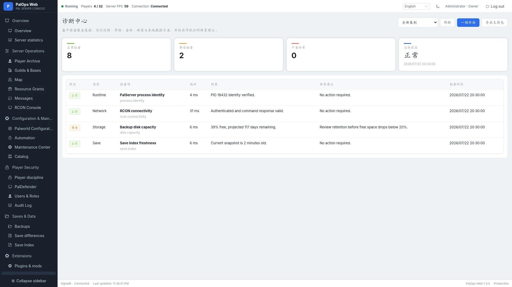<br><sub>Process, network, filesystem, configuration, resource, and support checks.</sub> | 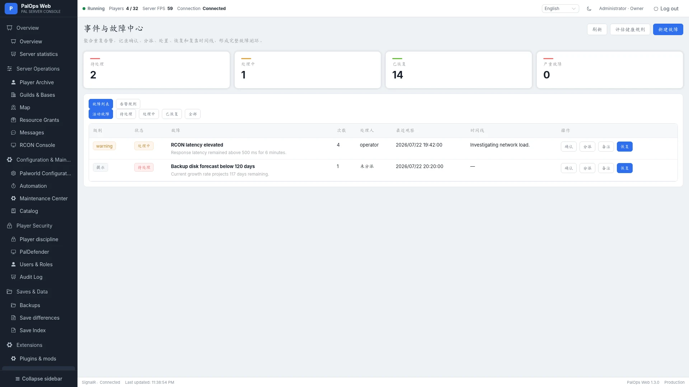<br><sub>Alert rules, aggregation, acknowledgement, assignment, recovery, and timelines.</sub> |

| Player insights | World governance |
|---|---|
| 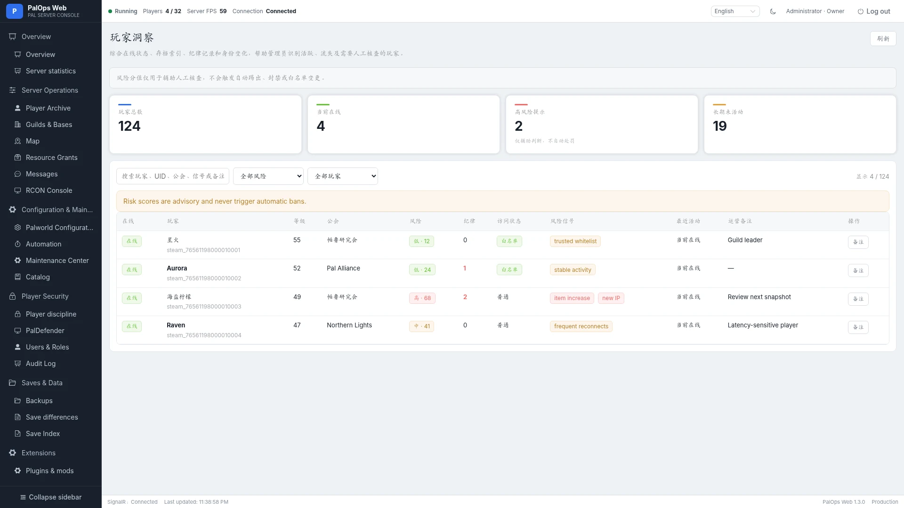<br><sub>Player timelines, activity, churn signals, and operator notes.</sub> | 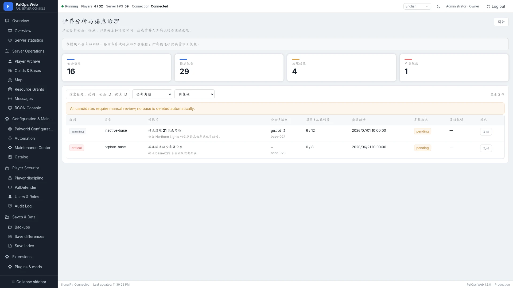<br><sub>Base ownership, governance candidates, review status, and human notes.</sub> |

### V1.3.1 platform capabilities

| Disaster recovery | Update center |
|---|---|
| 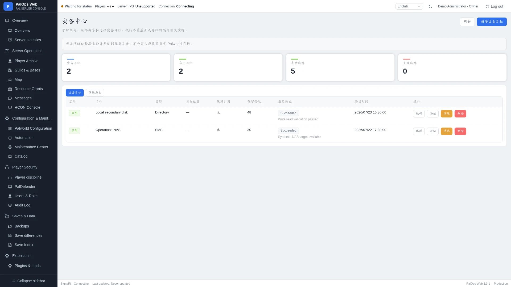<br><sub>DR targets, RPO/RTO, validation, and recovery drills.</sub> | 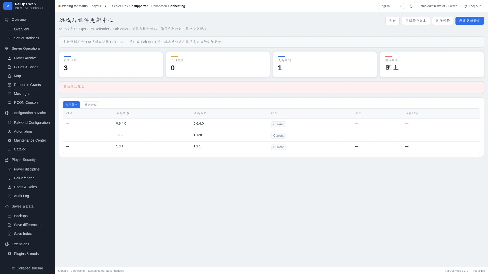<br><sub>Component versions, update preflight, approval, and health validation.</sub> |

| Configuration versions | Operations playbooks |
|---|---|
| 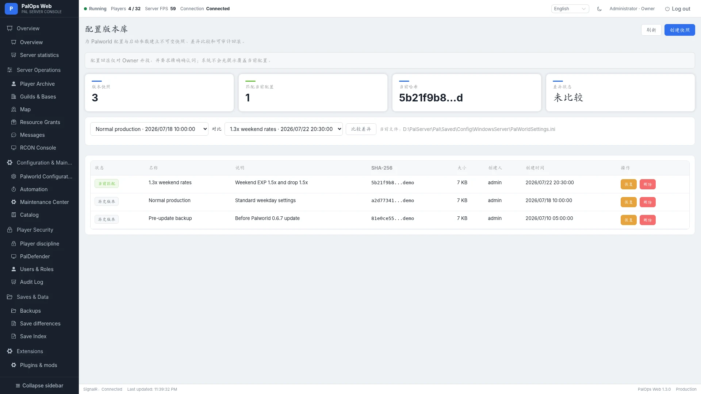<br><sub>Snapshots, diffs, current match, and controlled rollback.</sub> | 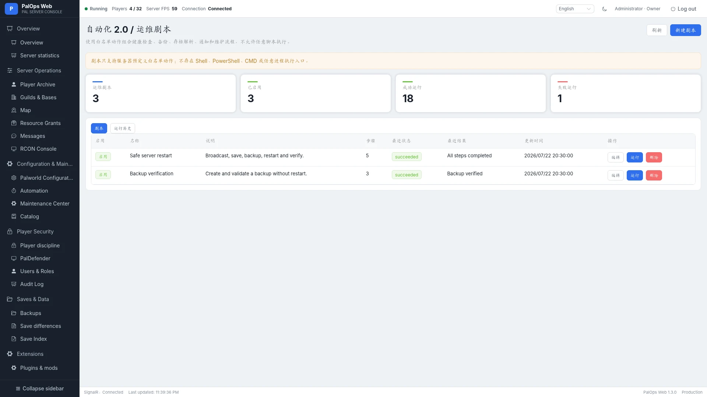<br><sub>Allow-listed actions, ordered steps, run history, and high-risk confirmation.</sub> |

| Security center | External integrations |
|---|---|
| 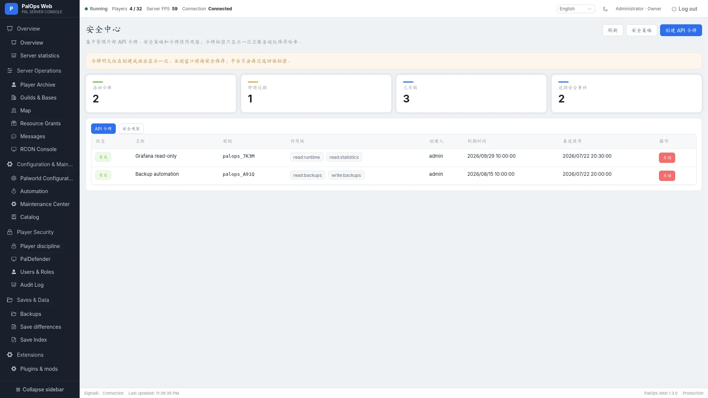<br><sub>Security policy, API tokens, scopes, expiry, and revocation.</sub> | 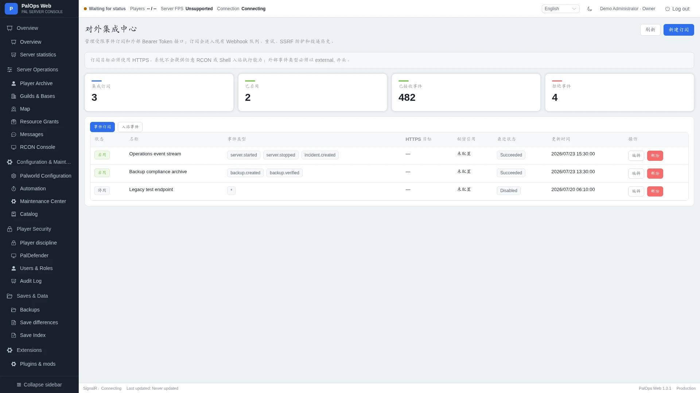<br><sub>HTTPS event subscriptions, secret references, retries, and delivery history.</sub> |

### Notifications and system governance

| Notification channels | Delivery history |
|---|---|
| <br><sub>Multi-provider webhooks, event subscriptions, templates, and retries.</sub> | <br><sub>Delivery state, HTTP result, latency, and failure details.</sub> |

| System settings | PalDefender |
|---|---|
| <br><sub>First-run tutorial, readiness checklist, connections, saves, and backups.</sub> | <br><sub>Connectivity, versions, config files, field help, and atomic persistence.</sub> |

| Save Index | Item & Pal catalog |
|---|---|
| <br><sub>Snapshot state, automatic parsing, format inspection, and manual jobs.</sub> | <br><sub>Offline catalog, icons, categories, aliases, favorites, and imports.</sub> |

| Audit log | System logs |
|---|---|
| <br><sub>Sensitive actions, outcomes, source addresses, and structured details.</sub> | <br><sub>Operational logs, level filters, search, and exception investigation.</sub> |

| Users & roles | About |
|---|---|
| <br><sub>Role-based accounts, enable/disable state, and recent sign-ins.</sub> | <br><sub>Version, data provenance, dependencies, and licensing.</sub> |

## PalDefender integration

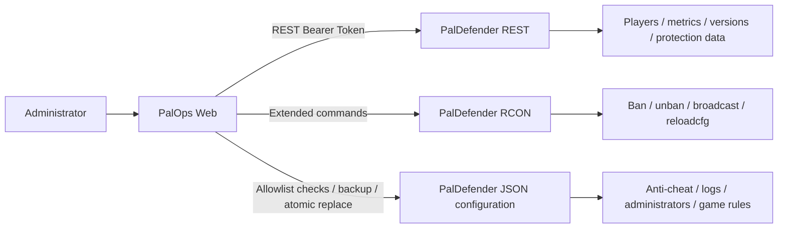

PalOps Web provides PalDefender version checks, REST URL/token connectivity, localized field documentation for the configuration set, strict JSON/type validation, path protection, SHA-256 conflict checks, pre-change backups, temporary-file writes, atomic replacement, and explicit `reloadcfg` / restart guidance.

See [PalDefender deployment](docs/paldefender-deployment.en.md) and [PalDefender configuration management](docs/paldefender-configuration-management.en.md).

## Architecture

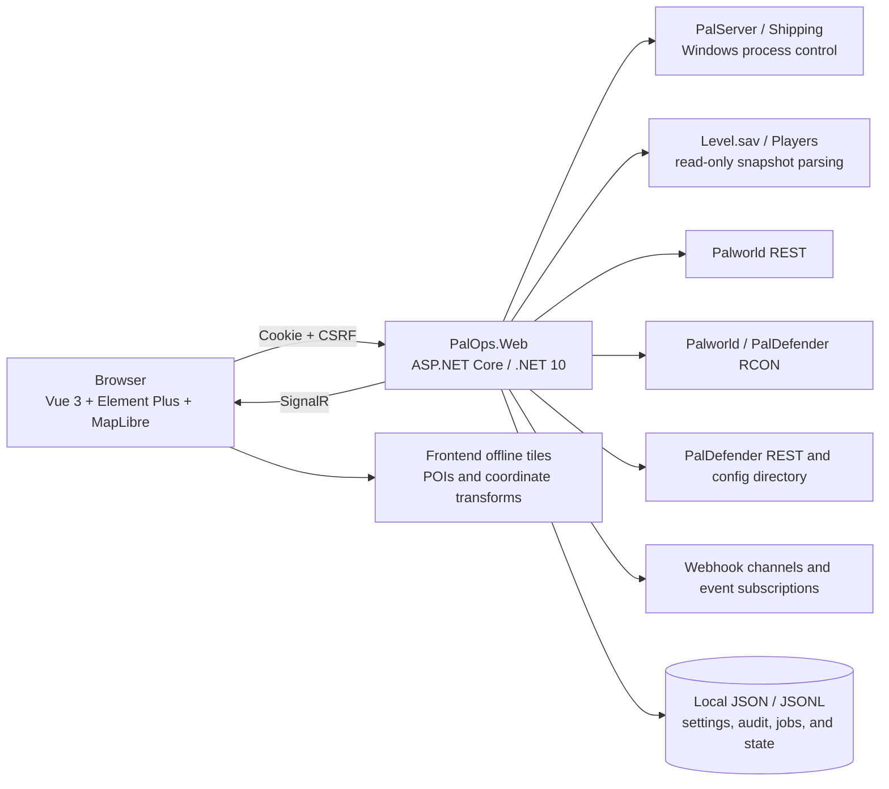

Security boundaries:

- The browser never receives PalDefender tokens and never controls PalServer or RCON directly.
- Every write passes identity, role, CSRF, confirmation, and structured-audit checks.
- Stop/kill operations revalidate the PID, executable path, and installation directory.
- Save parsing reads private snapshots and retains the last successful index on failure.
- PalDefender configuration access is restricted to allow-listed files and controlled relative paths.
- Map tiles, fixed POIs, and coordinate transforms are shipped as frontend static assets.

## Quick start

### Requirements

- Windows 10/11 or Windows Server;
- .NET 10 SDK;
- Node.js 22;
- a local Palworld Dedicated Server;
- PalDefender is recommended for protection, extended RCON, and enhanced live data.

### Build

```powershell
git clone https://github.com/CoderYiXin/PalOpsWeb.git
cd PalOpsWeb
.\scripts\build.ps1
```

Create a Windows x64 release package:

```powershell
.\scripts\fetch-map-tiles.ps1 -Layer all
.\scripts\publish-win-x64.ps1 -Version 1.3.1
```

Or build the layers separately:

```powershell
cd frontend-vue
npm ci
npm run build

cd ..
dotnet build PalOpsWeb.sln -c Release
```

The frontend production output is written to `src/PalOps.Web/wwwroot`; the ASP.NET Core release does not require a separately deployed frontend service.

### Recommended first-deployment order

1. Extract into a dedicated directory and run under a Windows account that can read Palworld saves and inspect PalServer processes.
2. Complete Owner initialization, then open **System Settings** and follow the first-use checklist.
3. Initialize local storage, configure the Palworld world-save path, and generate the first save index.
4. Configure and test Palworld REST; configure PalDefender REST when protection and extended features are required.
5. Configure RCON and validate the administrator password, port, and command-capability probe.
6. Configure a backup directory, create the first backup, and verify its SHA-256 result.
7. Enable automation, maintenance plans, notification channels, and DR targets as needed.
8. Expose the console only through a trusted LAN, VPN, or HTTPS reverse proxy.

When required configuration is missing, the affected page shows inline guidance and blocks unsafe actions. The notice disappears after readiness checks recover.

See the [build guide](docs/build.en.md), [deployment guide](docs/deployment.en.md), and [release checklist](docs/release-checklist.en.md).

## Documentation

Chinese is the default documentation language; major technical documents include an English counterpart.

| Topic | Chinese | English |
|---|---|---|
| Documentation home | [docs/README.md](docs/README.md) | [docs/README.en.md](docs/README.en.md) |
| Feature reference | [features.md](docs/features.md) | [features.en.md](docs/features.en.md) |
| Architecture | [architecture.md](docs/architecture.md) | [architecture.en.md](docs/architecture.en.md) |
| Build | [build.md](docs/build.md) | [build.en.md](docs/build.en.md) |
| Deployment | [deployment.md](docs/deployment.md) | [deployment.en.md](docs/deployment.en.md) |
| PalDefender deployment | [paldefender-deployment.md](docs/paldefender-deployment.md) | [paldefender-deployment.en.md](docs/paldefender-deployment.en.md) |
| PalDefender configuration | [paldefender-configuration-management.md](docs/paldefender-configuration-management.md) | [paldefender-configuration-management.en.md](docs/paldefender-configuration-management.en.md) |
| Map data | [world-map-data-1.2.0.md](docs/world-map-data-1.2.0.md) | [world-map-data-1.2.0.en.md](docs/world-map-data-1.2.0.en.md) |
| Release checklist | [release-checklist.md](docs/release-checklist.md) | [release-checklist.en.md](docs/release-checklist.en.md) |
| Screenshot inventory | [docs/images/README.md](docs/images/README.md) | [docs/images/README.en.md](docs/images/README.en.md) |

## GitHub Actions

`.github/workflows/build.yml` runs on pushes, pull requests, and manual dispatch:

1. Node.js 22 dependency installation, frontend contracts, TypeScript, and Vite build;
2. npm high-severity dependency audit;
3. .NET 10 restore and Release build;
4. directory, map, README, bilingual screenshot, documentation, and repository checks;
5. detection of runtime data, secrets, build caches, and internal-only files that must not enter the public source tree.

## Security, contributing, and license

- Never expose PalOps, Palworld REST, PalDefender REST, or RCON ports directly to the public internet.
- Never commit `data`, saves, databases, logs, Data Protection keys, passwords, tokens, cookies, or real production screenshots.
- Lifecycle control supports a local Windows PalServer only; the web UI primarily targets desktop browsers.
- Review [THIRD-PARTY-NOTICES.md](THIRD-PARTY-NOTICES.md) before redistributing map imagery.

See [SECURITY.md](SECURITY.md) for vulnerability reporting and [CONTRIBUTING.md](CONTRIBUTING.md) for contribution guidelines.

PalOps Web is released under **GNU GPL v3 or later**. Palworld and related names, trademarks, and game assets belong to their respective owners. This project is not affiliated with or endorsed by Pocketpair.
