<div align="center">

# PalOps Web

### 基于 PalDefender 防作弊插件能力打造的 Palworld 一体化服务器运营控制台

**1.3.1** 将 PalServer 生命周期、实时监控、离线世界地图、玩家与公会、物资发放、存档解析、配置维护、诊断治理、灾备、安全与外部集成统一到一个现代化 Web 工作台。

[English](README.en.md) · [中文文档](docs/README.md) · [English Docs](docs/README.en.md) · [功能总览](docs/features.md)

<a href="https://dotnet.microsoft.com/"></a>
<a href="https://vuejs.org/"></a>
<a href="https://github.com/Ultimeit/PalDefender"></a>
<a href="https://maplibre.org/maplibre-gl-js/docs/"></a>
<a href="https://learn.microsoft.com/zh-cn/windows-server/"></a>
<a href="LICENSE"></a>

</div>


> **截图说明：** README 中的全部界面图均来自 V1.3.1 当前前端页面，使用专用伪数据、虚构玩家/公会、保留地址和项目内置离线地图瓦片生成。截图不包含真实服务器 IP、世界 ID、账号、Token、Webhook、Cookie、存档路径或生产数据。

## V1.3.1 重点更新

- **地图标记优先级**：在线玩家标记始终位于公会据点之上；即使坐标重叠，玩家仍保持可见并优先响应点击。
- **地图定点传送**：地图点击直接使用 PalDefender 所需的地图 X/Y 坐标，可将一个或多个在线玩家传送到任意有效位置。
- **自动地形高度**：定点传送默认省略 Z，由 PalDefender 自动匹配目标地形高度；洞穴、地下或特殊区域仍可切换为手动 Z。
- **玩家实时互传**：支持将 A 玩家传送到 B 玩家执行时的实时位置，避免使用过期坐标。
- **探索进度重做**：地图探索状态改为整体完成度、分类进度、已发现/剩余数量以及未完成筛选，更适合长期地图收集。
- **本地数据自动初始化**：首次启动自动、幂等创建本地数据结构；正常启动不再显示修复入口，只有真实初始化失败时才提供恢复操作。
- **导航性能优化**：页面依赖检查改为缓存优先和后台静默刷新，配置完成后切换页面不再反复显示“正在检查页面依赖”，同时减少重复请求和页面重新挂载。
- **开源发布重制**：中文、英文 README 和全部 37 个功能画面重新截取，共 74 张 1920×1080 WebP；物资发放以三张连续截图完整展示“选玩家 → 选资源 → 核对执行”。

## 为什么选择 PalOps Web

PalOps Web 不是通用云面板。它面向**与 PalServer 同机部署的 Windows 专用服务器**，用于解决社区服长期运营中进程控制、玩家数据、存档、地图、PalDefender、防护配置、通知和审计彼此割裂的问题。

- **一个工作台**：运行监控、玩家、公会、地图、物资、配置、维护、存档、安全和治理统一管理。
- **本地优先**：存档只读解析、离线地图瓦片/POI、本地 JSON/JSONL 数据和审计链路均可在局域网环境运行。
- **安全写入**：身份认证、角色权限、CSRF、SHA-256 并发检查、修改前备份、原子替换和结构化审计。
- **PalDefender 深度集成**：REST、扩展 RCON、版本、白名单、封禁与完整配置文件管理。
- **首次部署友好**：未配置时页面安全降级并明确告诉管理员“还缺什么、去哪里配置”。

> PalDefender 与 PalOps Web 是独立项目。未安装 PalDefender 时，基础进程控制、存档解析、离线地图、备份及部分原生 REST/RCON 能力仍可按配置使用；依赖 PalDefender 的防护、扩展命令和特色实时数据会明确标记为未配置或不可用。

## 完整功能模块

| 分组 | 模块 | 主要能力 |
|---|---|---|
| 服务器态势 | **运行概览** | PalServer 状态、PID、运行时长、CPU/内存/磁盘、在线人数、Server FPS、版本与实时事件 |
| 服务器态势 | **服务器统计** | 在线人数、FPS、系统资源、异常、备份和 Webhook 的小时/日趋势 |
| 服务器数据 | **玩家管理** | 在线/离线玩家、等级、公会、坐标、背包、帕鲁、身份来源与最后在线 |
| 服务器数据 | **公会据点** | 公会成员、会长、据点归属证据、工作帕鲁、最近活动与地图定位 |
| 服务器数据 | **世界地图** | Palpagos / World Tree 离线瓦片、固定 POI、实时玩家、据点、自定义标记与探索状态 |
| 运营工具 | **物资发放** | 选择多个玩家、搜索物品/帕鲁、购物车核对、经验与科技点、任务结果 |
| 运营工具 | **消息发送** | 全服公告、警告、私聊、目标选择与受控玩家操作 |
| 运营工具 | **RCON 控制台** | 标准与 PalDefender 扩展命令、能力探测、高风险确认和响应历史 |
| 配置与运维 | **Palworld 配置** | PalWorldSettings.ini、启动参数、字段说明、差异、校验和安全保存 |
| 配置与运维 | **自动任务** | Cron/周期任务、备份、公告、重启、风险等级、下次运行与历史 |
| 配置与运维 | **维护中心** | 保存、备份、停服、脚本、启动、健康验证与崩溃守护 |
| 配置与运维 | **插件与模组** | 插件/模组盘点、版本、依赖、兼容性、更新、备份和回滚 |
| 玩家安全 | **玩家纪律** | 白名单、封禁、解封、踢出、身份历史、违规记录与审计 |
| 玩家安全 | **PalDefender 防护组件** | REST/版本、Config.json、Token、名单、规则、校验、备份与原子保存 |
| 存档与数据 | **存档备份** | 手动/自动备份、SHA-256 校验、保留策略、下载、恢复预检与受保护恢复 |
| 存档与数据 | **存档差异** | 快照比较、玩家/公会/据点/物品/帕鲁变化和异常提示 |
| 存档与数据 | **存档解析** | Level.sav / Players 只读快照、格式检测、进度、自动策略和失败回退 |
| 存档与数据 | **目录管理** | 物品与帕鲁目录、图标、分类、别名、收藏、搜索和导入 |
| 诊断与事件 | **诊断中心** | 一键体检、进程、网络、存档、目录、资源、配置和支持包 |
| 诊断与事件 | **事件与故障中心** | 告警规则、事件聚合、确认、分派、处置、恢复、关闭和故障时间线 |
| 洞察与治理 | **玩家洞察** | 玩家时间线、活跃度、回流/流失识别、纪律关联和辅助风险信号 |
| 洞察与治理 | **世界治理** | 据点归属、孤儿据点、长期不活跃候选、治理复核和人工确认 |
| 平台能力 | **灾备中心** | 灾备目标、RPO/RTO、备份副本、验证、恢复演练和历史 |
| 平台能力 | **更新中心** | PalServer/PalDefender/组件盘点、版本检查、预检、审批和健康验证 |
| 平台能力 | **配置版本库** | 配置快照、差异、说明、当前匹配、恢复前自动备份和受控回滚 |
| 平台能力 | **运维剧本** | 白名单动作、顺序步骤、条件、失败分支、执行历史和高风险确认 |
| 平台能力 | **安全中心** | 安全策略、API Token、作用域、有效期、吊销和安全观测 |
| 平台能力 | **对外集成** | HTTPS 事件订阅、事件类型、签名密钥引用、重试与投递记录 |
| 通知系统 | **消息通知** | 企业微信、钉钉、飞书、Discord、Slack、Telegram 和通用 JSON Webhook |
| 通知系统 | **推送记录** | 成功、重试、失败、HTTP 状态、耗时、请求/响应摘要和错误原因 |
| 系统治理 | **系统设置** | 首用教程、连接配置、存档、备份、自动任务、权限与安全配置 |
| 系统治理 | **权限管理** | Owner、Administrator、Operator、Auditor、Viewer 分级账户与启停 |
| 系统治理 | **审计日志** | 登录、配置、进程、备份、RCON、通知、权限和高风险操作审计 |
| 系统治理 | **系统日志** | 降噪业务日志、级别筛选、全文检索、异常详情与诊断定位 |
| 系统治理 | **关于系统** | 版本、开源依赖、地图数据来源、许可证和项目边界 |

## 产品界面

### 服务器态势与数据管理

| 玩家管理 | 公会据点 |
|---|---|
| <br><sub>在线/离线玩家、角色信息、背包与帕鲁档案。</sub> | <br><sub>成员、会长、归属证据、据点和地图定位。</sub> |


| Palworld 配置 | 服务器统计 |
|---|---|
| <br><sub>结构化参数、启动参数、诊断、差异和安全保存。</sub> | <br><sub>玩家、FPS、资源和运营事件趋势。</sub> |

### 物资发放三步流程

#### 第一步：选择发放玩家

按在线状态、公会、角色信息选择一个或多个目标，避免把资源误发给错误玩家。


#### 第二步：选择资源

支持物品和帕鲁分类、中文名、英文名、内部 ID 及空格分隔的多元素搜索，并批量加入发放清单。


#### 第三步：核对并执行

再次核对玩家、资源、数量、经验/科技点和执行范围；实际写操作仍经过权限、确认与审计。


### 日常运营与维护

| 消息发送 | RCON 控制台 |
|---|---|
| <br><sub>公告、警告、定向消息和受控玩家操作。</sub> | <br><sub>命令模板、能力探测、高风险确认和响应历史。</sub> |

| 自动任务 | 维护中心与崩溃守护 |
|---|---|
| <br><sub>周期任务、风险等级、下次运行和执行结果。</sub> | <br><sub>安全维护编排、健康验证、自动恢复与熔断。</sub> |

| 存档备份 | 存档差异 |
|---|---|
| <br><sub>备份、校验、下载、恢复预检和保留策略。</sub> | <br><sub>快照变化、异常提示和重要资源变化。</sub> |

| 玩家纪律 | 插件与模组 |
|---|---|
| <br><sub>白名单、封禁、身份、违规、踢出和审计。</sub> | <br><sub>版本、依赖、兼容性、更新、备份和回滚。</sub> |

### V1.3.1 诊断、事件与洞察

| 诊断中心 | 事件与故障中心 |
|---|---|
| 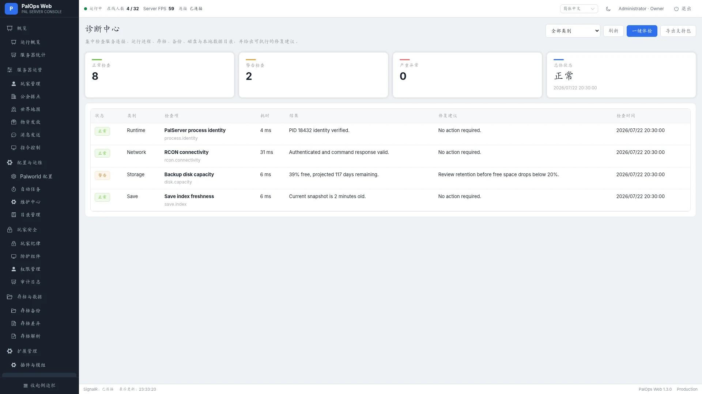<br><sub>进程、网络、文件、配置、资源和支持包。</sub> | 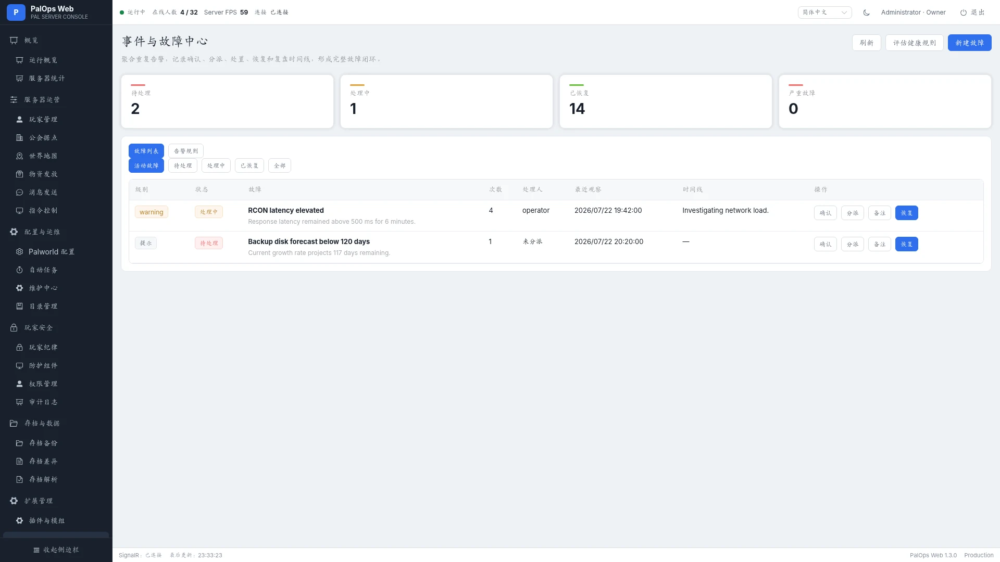<br><sub>告警规则、聚合、确认、分派、恢复和时间线。</sub> |

| 玩家洞察 | 世界分析与据点治理 |
|---|---|
| 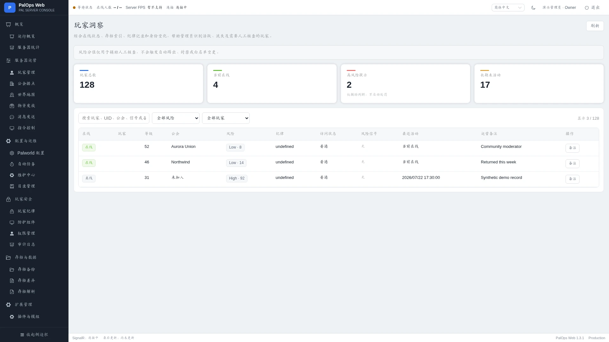<br><sub>玩家时间线、活跃度、流失信号和运营备注。</sub> | 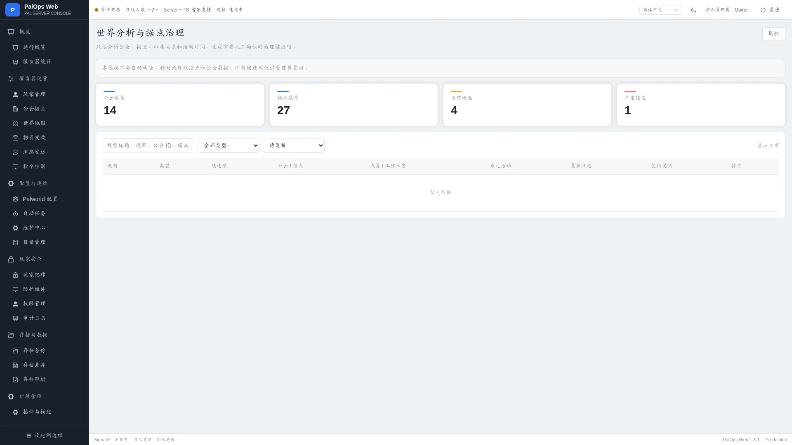<br><sub>据点归属、治理候选、复核状态与人工说明。</sub> |

### V1.3.1 平台能力

| 灾备中心 | 更新中心 |
|---|---|
| 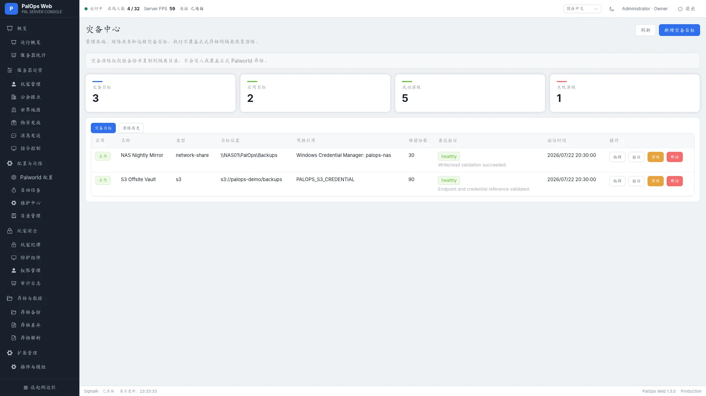<br><sub>灾备目标、RPO/RTO、验证和恢复演练。</sub> | 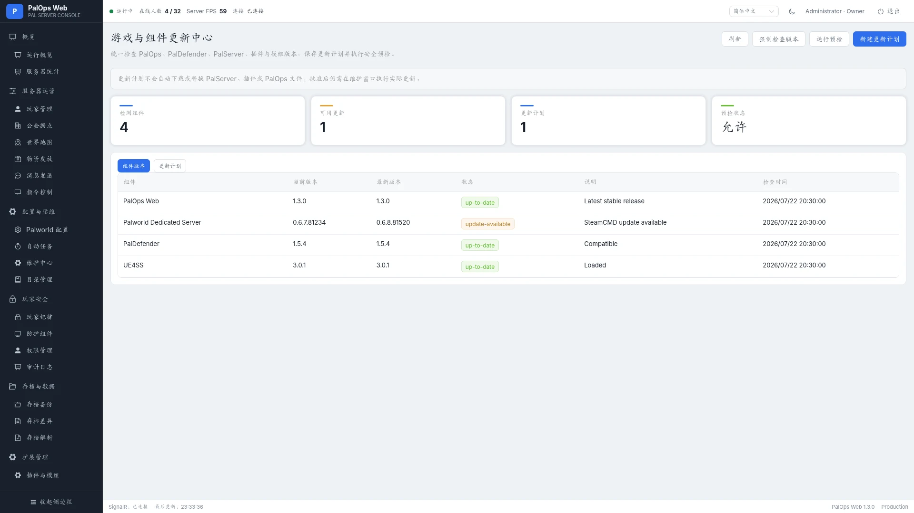<br><sub>组件版本、更新预检、审批和健康验证。</sub> |

| 配置版本库 | 运维剧本 |
|---|---|
| 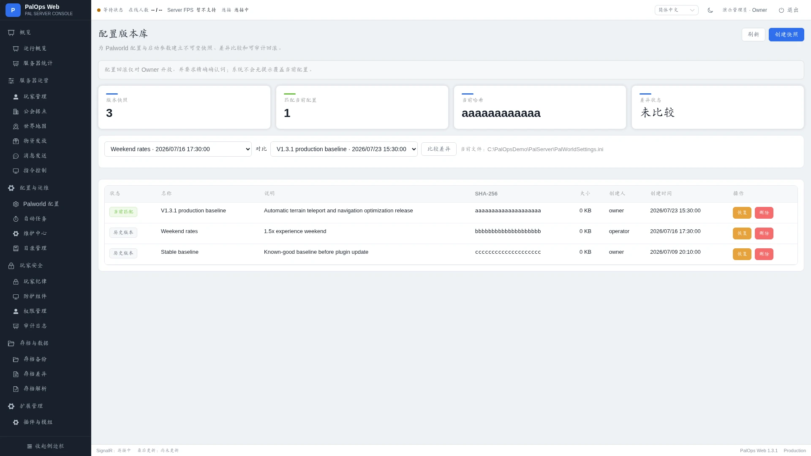<br><sub>快照、差异、当前匹配与受控回滚。</sub> | 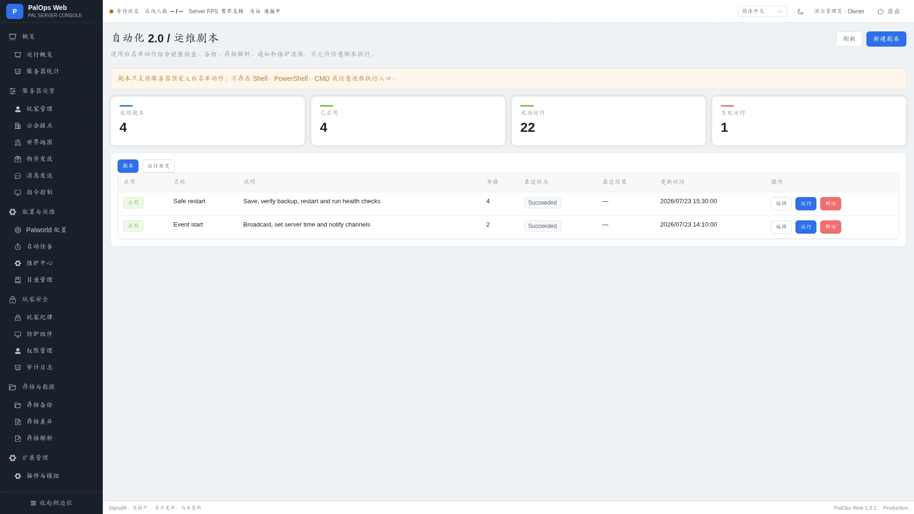<br><sub>白名单动作、顺序步骤、执行历史和高风险确认。</sub> |

| 安全中心 | 对外集成 |
|---|---|
| 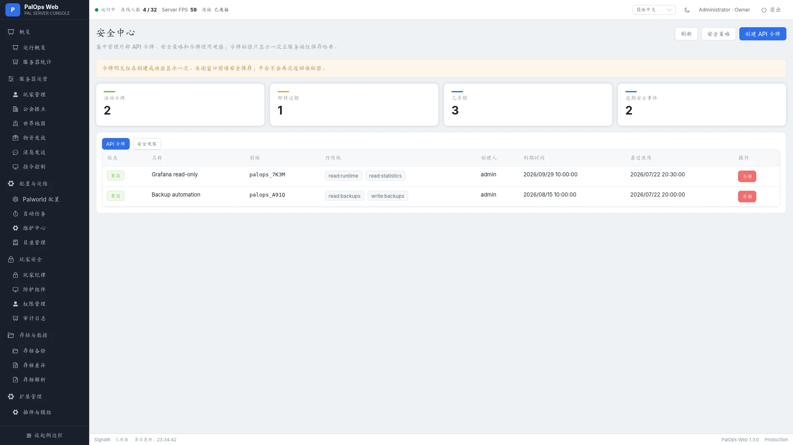<br><sub>安全策略、API Token、作用域、过期与吊销。</sub> | 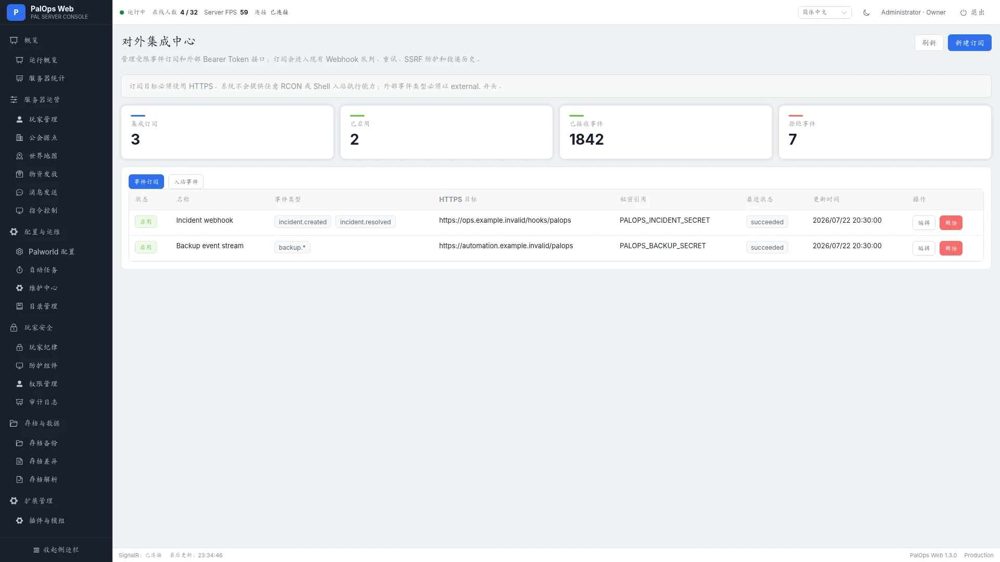<br><sub>HTTPS 事件订阅、签名引用、重试和投递历史。</sub> |

### 通知与系统治理

| 消息通知 | 推送记录 |
|---|---|
| <br><sub>多渠道 Webhook、事件订阅、模板和重试策略。</sub> | <br><sub>投递状态、HTTP 结果、耗时和失败原因。</sub> |

| 系统设置 | PalDefender 防护组件 |
|---|---|
| <br><sub>首次使用教程、配置清单、连接、存档和备份设置。</sub> | <br><sub>连接、版本、配置文件、字段说明和原子保存。</sub> |

| 存档解析 | 物品与帕鲁目录 |
|---|---|
| <br><sub>快照状态、自动解析、格式检测和手动任务。</sub> | <br><sub>离线目录、图标、分类、别名、收藏与导入。</sub> |

| 审计日志 | 系统日志 |
|---|---|
| <br><sub>关键操作、结果、来源地址和结构化详情。</sub> | <br><sub>业务日志、级别筛选、搜索和异常定位。</sub> |

| 权限管理 | 关于系统 |
|---|---|
| <br><sub>多角色账户、启停状态和最近登录。</sub> | <br><sub>版本、数据来源、开源依赖和许可证说明。</sub> |

## PalDefender 特色集成

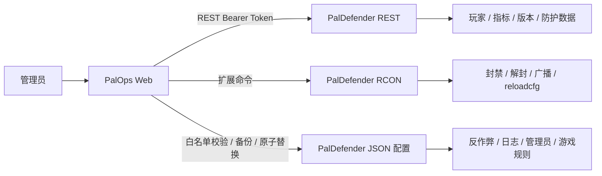

PalOps Web 提供 PalDefender 当前版本检查、REST 地址与 Token 连通性、完整配置文件中文说明、严格 JSON/type 校验、路径保护、SHA-256 冲突检查、修改前备份、临时文件写入、原子替换以及 `reloadcfg` / 重启提示。

安装与 Token 配置见 [PalDefender 部署说明](docs/paldefender-deployment.md) 和 [PalDefender 配置管理](docs/paldefender-configuration-management.md)。

## 系统架构

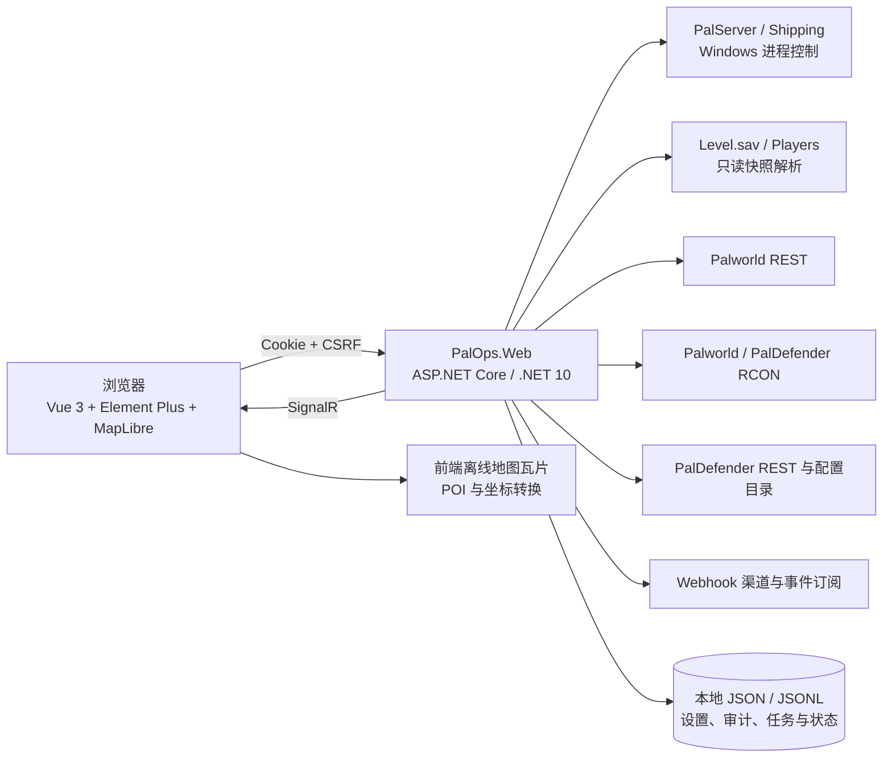

关键安全边界：

- 浏览器不直接读取 PalDefender Token，也不直接操作 PalServer 或 RCON。
- 所有写操作经过身份、角色权限、CSRF、确认词和结构化审计。
- 停服与强停前重新验证 PID、可执行文件路径和服务器安装目录。
- 存档解析只读取私有快照；解析失败时保留最后一份成功索引。
- PalDefender 配置只允许白名单文件和受控相对路径。
- 地图瓦片、固定 POI 和坐标转换作为前端静态资源发布。

## 快速开始

### 环境要求

- Windows 10/11 或 Windows Server；
- .NET 10 SDK；
- Node.js 22；
- 本机 Palworld Dedicated Server；
- 推荐安装 PalDefender，以启用防护、扩展 RCON 与特色实时数据能力。

### 构建

```powershell
git clone https://github.com/CoderYiXin/PalOpsWeb.git
cd PalOpsWeb
.\scripts\build.ps1
```

生成 Windows x64 发布包：

```powershell
.\scripts\fetch-map-tiles.ps1 -Layer all
.\scripts\publish-win-x64.ps1 -Version 1.3.1
```

也可以分别构建：

```powershell
cd frontend-vue
npm ci
npm run build

cd ..
dotnet build PalOpsWeb.sln -c Release
```

前端生产产物写入 `src/PalOps.Web/wwwroot`，ASP.NET Core 发布包不需要单独部署前端服务。

### 首次部署建议顺序

1. 解压到独立目录并使用有权读取 Palworld 存档、检查 PalServer 进程的 Windows 账户启动。
2. 完成 Owner 初始化，然后优先进入 **系统设置** 查看首次使用配置清单。
3. 初始化本地数据目录，配置 Palworld 世界存档路径并生成第一份存档索引。
4. 配置并测试 Palworld REST；需要防护与扩展能力时配置 PalDefender REST。
5. 配置 RCON，并确认管理员密码、端口和命令能力探测结果。
6. 配置备份目录，执行第一份备份并验证 SHA-256。
7. 根据需要启用自动任务、维护计划、通知渠道和灾备目标。
8. 仅通过受信任 LAN、VPN 或 HTTPS 反向代理开放管理入口。

依赖检查默认在后台静默执行并复用短期缓存；只有确认缺少必要配置时，相关页面才显示内嵌说明并阻止不安全操作。配置完成后缓存会被刷新，页面切换不再反复出现检查遮罩。

完整说明见 [构建文档](docs/build.md)、[部署文档](docs/deployment.md) 和 [发布检查清单](docs/release-checklist.md)。

## 文档

默认文档为中文，每份主要技术文档提供 English 对应页。

| 主题 | 中文 | English |
|---|---|---|
| 文档首页 | [docs/README.md](docs/README.md) | [docs/README.en.md](docs/README.en.md) |
| 功能说明 | [features.md](docs/features.md) | [features.en.md](docs/features.en.md) |
| 架构 | [architecture.md](docs/architecture.md) | [architecture.en.md](docs/architecture.en.md) |
| 构建 | [build.md](docs/build.md) | [build.en.md](docs/build.en.md) |
| 部署 | [deployment.md](docs/deployment.md) | [deployment.en.md](docs/deployment.en.md) |
| PalDefender 部署 | [paldefender-deployment.md](docs/paldefender-deployment.md) | [paldefender-deployment.en.md](docs/paldefender-deployment.en.md) |
| PalDefender 配置 | [paldefender-configuration-management.md](docs/paldefender-configuration-management.md) | [paldefender-configuration-management.en.md](docs/paldefender-configuration-management.en.md) |
| 地图数据 | [world-map-data-1.2.0.md](docs/world-map-data-1.2.0.md) | [world-map-data-1.2.0.en.md](docs/world-map-data-1.2.0.en.md) |
| 发布检查 | [release-checklist.md](docs/release-checklist.md) | [release-checklist.en.md](docs/release-checklist.en.md) |
| 截图清单 | [docs/images/README.md](docs/images/README.md) | [docs/images/README.en.md](docs/images/README.en.md) |

## GitHub Actions

`.github/workflows/build.yml` 在 push、Pull Request 和手动触发时执行：

1. Node.js 22 依赖安装、前端契约、TypeScript 与 Vite 构建；
2. npm 高危依赖审计；
3. .NET 10 restore 与 Release build；
4. 目录、地图、README、双语截图、文档和源码仓库校验；
5. 运行数据、密钥、编译缓存和不允许发布的内部文件残留检查。

## 安全、贡献与许可证

- 不要把 PalOps、Palworld REST、PalDefender REST 或 RCON 端口直接暴露到公网。
- 不要提交 `data`、存档、数据库、日志、Data Protection 密钥、密码、Token、Cookie 或真实截图。
- 生命周期控制只支持 Windows 本机 PalServer；Web UI 以桌面浏览器为主要目标。
- 地图图像再分发前请核对 [THIRD-PARTY-NOTICES.md](THIRD-PARTY-NOTICES.md)。

漏洞报告见 [SECURITY.md](SECURITY.md)，贡献流程见 [CONTRIBUTING.md](CONTRIBUTING.md)。

PalOps Web 以 **GNU GPL v3 或更高版本**发布。Palworld 及相关名称、商标和游戏资产归各自权利人所有；本项目与 Pocketpair 无隶属或背书关系。
